<div align="center">

# Crivacy

### Verify once. Prove anything. Reveal nothing.

Re-usable KYC credentials that live on-chain, fully encrypted with Zama FHEVM.
A person verifies their identity a single time. From then on any firm can confirm a plain
yes or no eligibility answer straight from the blockchain, without ever seeing a document,
a name, or a score.

[](https://docs.zama.ai/protocol)
[](https://sepolia.etherscan.io/address/0x91f410FfCF51abd0389890968b243bb9A32Eb94B)
[](fhevm/contracts/CrivacyKYC.sol)
[](https://nextjs.org)
[](https://www.typescriptlang.org)
[](#license)

</div>

<br/>

<table width="100%">
<tr>
<td><b>Network</b></td><td>Sepolia</td>
<td><b>Encryption</b></td><td>Zama FHEVM, <code>euint8</code> and <code>ebool</code></td>
</tr>
<tr>
<td><b>Registry</b></td><td><a href="https://sepolia.etherscan.io/address/0x91f410FfCF51abd0389890968b243bb9A32Eb94B"><code>CrivacyKYC</code> · 0x91f4…Eb94B</a></td>
<td><b>Soulbound pass</b></td><td><a href="https://sepolia.etherscan.io/address/0x27A9E3DED8a97cC31F451302Fc069b42A72F602a"><code>CrivacyKycNFT</code> · 0x27A9…F602a</a></td>
</tr>
<tr>
<td><b>Identity</b></td><td>Licensed KYC provider</td>
<td><b>Stack</b></td><td>Next.js 15 · Solidity · Postgres · viem</td>
</tr>
</table>

<br/>

<!-- =========================================================
     MEDIA SLOT 1 — DEMO VIDEO
     Thumbnail at docs/media/demo-thumbnail.png, YouTube link in href.
     First thing a visitor sees: the whole arc in one clip.
     ========================================================= -->
<div align="center">

<a href="https://www.youtube.com/watch?v=GP8tvX0on-0">
  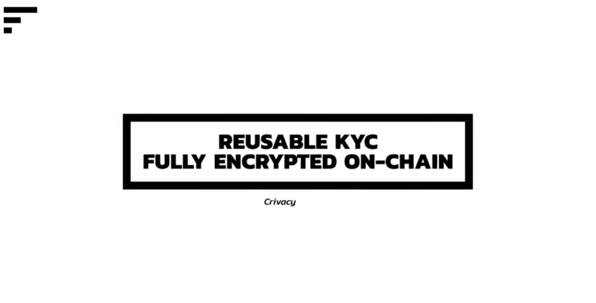
</a>

<em>Full walkthrough in under three minutes. Click to play.</em>

</div>

<br/>

## Contents

1. [In one look](#in-one-look)
2. [The problem](#the-problem)
3. [How it compares](#how-it-compares)
4. [System architecture](#system-architecture)
5. [Who can do what](#who-can-do-what)
6. [Why fully homomorphic encryption](#why-fully-homomorphic-encryption)
7. [The FHE access model](#the-fhe-access-model)
8. [Trust boundary](#trust-boundary)
9. [How FHE is used](#how-fhe-is-used)
10. [FHE capability map](#fhe-capability-map)
11. [What Crivacy guarantees](#what-crivacy-guarantees)
12. [Flows by case](#flows-by-case)
13. [Soulbound proof](#soulbound-proof)
14. [Credential lifecycle](#credential-lifecycle)
15. [For firms](#for-firms)
16. [OAuth, the user, firm, and Crivacy](#oauth-the-user-firm-and-crivacy)
17. [Trustless verification](#trustless-verification)
18. [Smart contracts](#smart-contracts)
19. [Security](#security)
20. [Tech stack](#tech-stack)
21. [Repository layout](#repository-layout)
22. [Getting started](#getting-started)
23. [License](#license)

<br/>

## In one look

A person connects their wallet and passes a real identity check once. Crivacy encrypts the
result and writes it to a smart contract on Sepolia, where the sensitive fields are stored as
ciphertext, not plaintext. The person owns the credential on their wallet and decides, per
firm, who may read what. A firm adds one button and receives a cryptographically verifiable
yes or no, decrypted from the chain only for the answer the user granted. No documents, no
name, no raw score ever leaves the user.

<br/>

## The problem

Every bank, exchange, and fintech asks the same person for the same passport, the same selfie,
the same proof of address. Each copy is a new place the data can leak. The industry is stuck
between two bad options:

* Firms **hold** the sensitive data themselves and carry the breach risk forever.
* Firms **trust a vendor's word** that a person passed, with no way to check it independently.

Crivacy removes the trade off. Verification happens once, the result lives on a public chain in
encrypted form, and a firm can confirm it cryptographically while holding zero personal data.

<br/>

## How it compares

| | Hold the data yourself | Trust the vendor's word | Crivacy |
|---|---|---|---|
| Who stores the personal data | Every firm, forever | The vendor | Nobody; on chain it is ciphertext |
| Breach surface | One per firm | The vendor | None on chain |
| A returning user re-verifies | Every time | Sometimes | Never |
| Independent proof of the result | Not possible | No | Yes, read from the chain |
| User controls who sees it | No | No | Yes, per firm and revocable |

<br/>

## System architecture

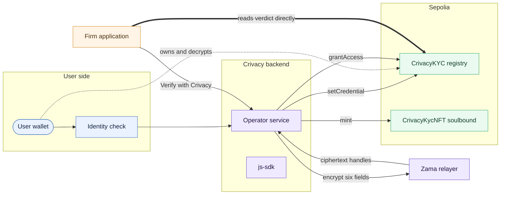

Every write to the chain is signed and paid for by the operator, so a user never needs gas to
hold a credential. Every read of the verdict is done by the firm against the chain with its own
node, so Crivacy is never in the middle of a verification.

<br/>

## Who can do what

Three parties, three clearly separated sets of powers. The user owns, Crivacy gatekeeps, the
firm relies.

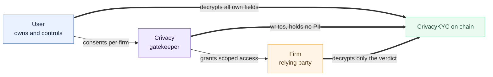

| Party | Can do | Cannot do |
|---|---|---|
| **User** | Verify once, decrypt every one of their own fields, approve or deny each firm, self revoke at any time | Nothing they do not own; they cannot read another user |
| **Crivacy** | Run the KYC, encrypt the result, write and pay gas on chain, grant and revoke per firm access | Hand a firm any plaintext PII; the operator never holds documents in the clear |
| **Firm** | Add one button, read the plaintext lifecycle on chain, decrypt only the eligibility verdict it was granted | See a document, a name, an address, or the raw score |

<br/>

## Why fully homomorphic encryption

A credential is only re-usable if it can live somewhere public and permanent. A public chain
gives you that, but a public chain is readable by everyone, which is the opposite of what KYC
data needs. Fully homomorphic encryption resolves the contradiction: values are stored as
ciphertext, computation runs on that ciphertext, and plaintext is revealed only to parties who
hold an explicit decryption grant.

The credential splits cleanly into what is safe in the open and what stays sealed.

| Field | Stored as | Who can read it |
|---|---|---|
| `userRefHash`, `proofHash` | plaintext `bytes32` | anyone |
| `status`, `isActive`, `validUntil`, `issuedAt` | plaintext | anyone |
| `validator` | plaintext | anyone |
| `level`, `humanScore` | encrypted `euint8` | holder, operator |
| `identityVerified`, `livenessVerified`, `addressVerified`, `sanctioned` | encrypted `ebool` | holder, operator |
| `eligible`, the composite verdict | encrypted `ebool` | a granted firm, per firm |

<br/>

## The FHE access model

The same credential is read very differently depending on who is asking. The lifecycle is open
so anyone can confirm a credential exists and is active. The sensitive fields are sealed behind
the access control list. Only the composite verdict is ever exposed to a firm, and only after a
grant.

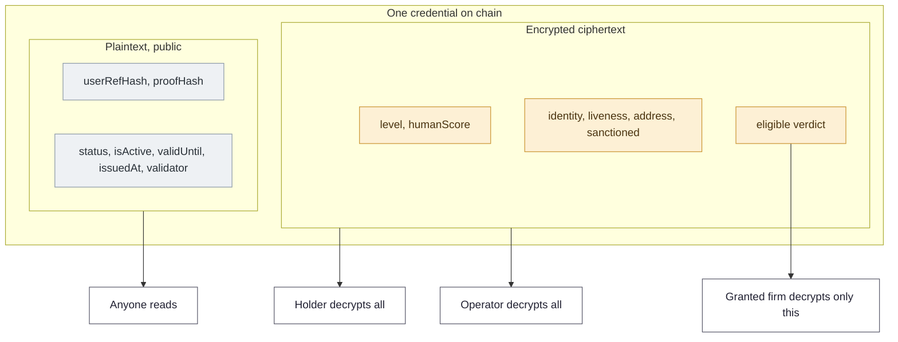

> **Access, precisely.** A grant is per user and firm pair. Extend it by granting another firm;
> narrow it by requiring a higher level or by revoking one firm. Each grant is independent, so
> closing one firm leaves the rest untouched. Two keys have to turn: the user approves on the
> consent screen and the operator executes the grant on chain, so a user cannot self grant a firm
> and the operator cannot grant a firm the user never approved. The user, or Crivacy on a fraud
> signal, revokes at any time, and a revoked firm's next read returns ciphertext it can no longer
> decrypt.

<br/>

## Trust boundary

The line that matters is where personal data stops. Raw documents never leave the licensed
provider. Only ciphertext and hashes are written to the chain. Only a single verdict, and only
when granted, reaches a firm.

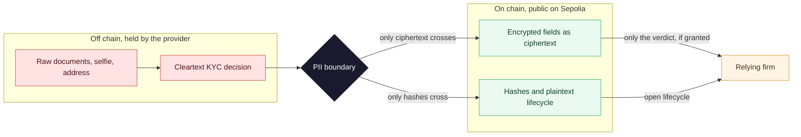

<br/>

## How FHE is used

Crivacy leans on the FHEVM primitives directly. Each capability maps to a concrete step in the
credential lifecycle.

| FHE capability | How Crivacy uses it |
|---|---|
| Encrypted integer and boolean types (`euint8`, `ebool`) | The six sensitive fields are declared as encrypted types, so the ledger never stores a readable score or flag. |
| Client side encryption under a single input proof (`externalEuint8`, `externalEbool`, `FHE.fromExternal`, `inputProof`) | The operator encrypts all six fields in one relayer bundle; the contract ingests them with `FHE.fromExternal` under one shared proof, so a credential write is one transaction, not six. |
| Homomorphic computation on ciphertext (`FHE.ge`, `FHE.and`, `FHE.not`) | The verdict is computed on chain as `level meets the firm's threshold AND not sanctioned`, straight over the ciphertext. The chain returns a yes or no `ebool` while blind to the score and flags behind it. |
| Access control list (`FHE.allowThis`, `FHE.allow`) | The contract keeps compute rights; the holder and the operator are granted decryption of the fields at issue time. Nobody else is on the list by default. |
| Per firm grant (`grantAccess`) | On user consent, the contract adds one firm's address to the `eligible` handle only. The grant is scoped to a single firm and a single field. |
| Revocable grant (`revokeAccess`) | The grant is reset to an empty handle. The firm's next read returns ciphertext it cannot decrypt. |

The consequence that matters: the encrypted verdict is computed on the chain and read by the
firm, and Crivacy sits outside that path. We issue the credential; we do not have to be trusted
for the answer.

<br/>

## FHE capability map

Being precise about what the current deployment runs, what the contract and SDK already support,
and what is left out on purpose.

| Capability | Status | Notes |
|---|---|---|
| Encrypted storage, `euint8` and `ebool` | Active | The six sensitive fields are stored as ciphertext. |
| One input proof per write, `FHE.fromExternal` | Active | All six fields encrypted in a single relayer bundle. |
| Owner and operator decryption, `FHE.allow` / `FHE.allowThis` | Active | The holder reads their own level and score; the operator powers the server-side read. |
| Trustless firm check on the plaintext lifecycle, `verify` and `isActive` | Active | A firm confirms an active credential straight from the chain, with no decryption. |
| Per-firm encrypted verdict, `grantAccess` plus on-chain `FHE.ge` / `FHE.and` / `FHE.not` | Ready in the contract and SDK | The `eligible` verdict is computed on ciphertext and decrypted only by a granted firm. Switched on per integration; the demo relies on the plaintext lifecycle above. |
| Any KYC vendor behind one adapter | Active shape | The vendor sits behind an adapter (`fhe-adapter-*`). Whoever ran the check, the on-chain credential is encrypted the same way. |
| ZK validator swap, `ValidatorType.ZK` and `migrateValidator` | Reserved | Re-point a credential to a ZK proof source without re-running KYC. |
| Richer encrypted scoring, wider `euint` and homomorphic arithmetic | Reserved | Weighted or composite scores computed on ciphertext, beyond the current compare-only logic. |
| On-chain public decryption, `FHE.requestDecryption` | Left out on purpose | The verdict is never published on chain; only a granted party decrypts it off-chain via the relayer. |

<br/>

## What Crivacy guarantees

> These are cryptographic properties, not policy promises.

* A firm learns exactly one bit, eligible yes or no, and only after the user grants it.
* The raw score, the flags, and the documents never leave the user and the provider.
* Every verdict is reproducible from the chain by the firm itself, with no call to Crivacy.
* The user can revoke any firm at any time, and the whole credential is theirs to self revoke.
* Crivacy writes and pays for the credential yet holds no personal data in the clear.

<br/>

## Flows by case

### Case A, verify once

A new user onboards. This happens a single time, ever.

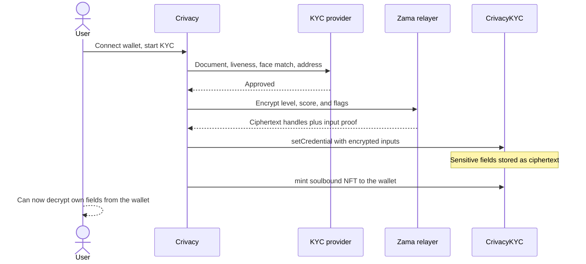

<!-- MEDIA SLOT 2 — KYC PAGE, file: docs/media/kyc-page.png -->
<div align="center">
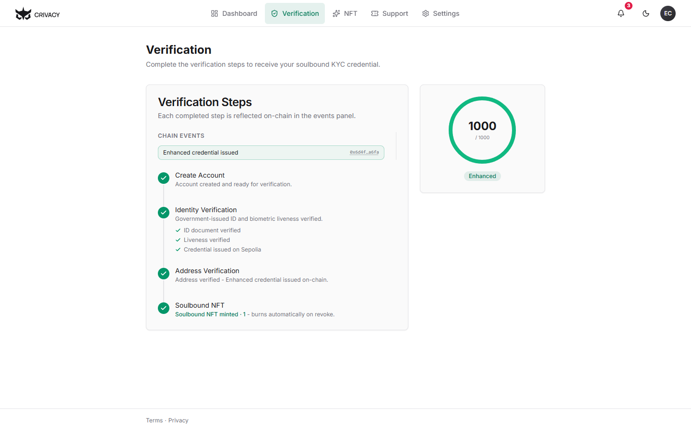
<br/><em>Identity is verified a single time. Proof of address upgrades the credential to Enhanced.</em>
</div>

### Case B, a firm verifies a returning user

The reuse. No new KYC, no re-uploaded document.

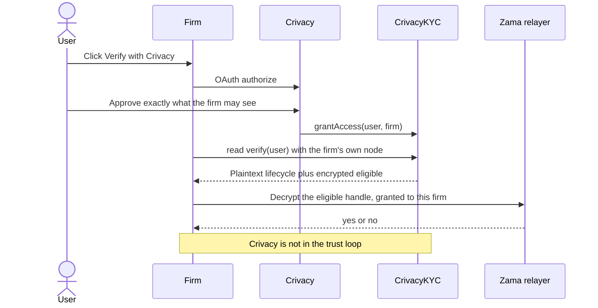

<!-- MEDIA SLOT 3 — SCORE / CREDENTIAL PAGE, file: docs/media/score-page.png -->
<div align="center">
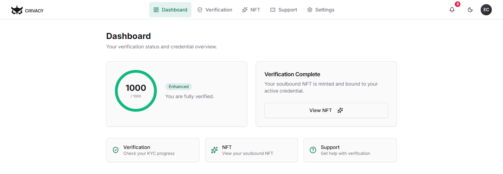
<br/><em>The holder's view. Level, score, and flags are decrypted locally by the wallet. On chain they are ciphertext.</em>
</div>

### Case C, revoke

The user or Crivacy closes access. A firm loses the ability to re-check going forward.

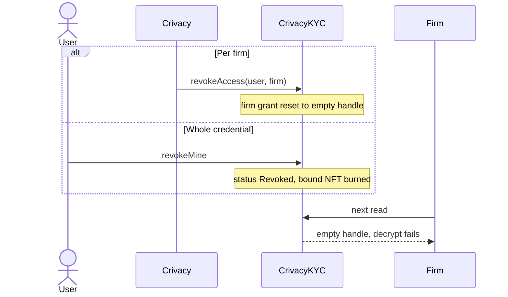

<br/>

## Soulbound proof

Every credential mints a soulbound NFT to the holder's wallet. It is non transferable and burns
automatically on revoke, so the token in a wallet is a live, public signal that the person holds
an active credential, while the sensitive data behind it stays encrypted on chain.

<!-- =========================================================
     MEDIA SLOT 6 and 7 — NFT CARDS, side by side
     Files: docs/media/nft-dark.png and docs/media/nft-light.png
     Screenshot the credential NFT from the customer credential
     page. Capture just the card. Keep both roughly the same
     aspect so the row stays even. width 380 each fits GitHub in
     one row without shrinking too far.
     ========================================================= -->
<div align="center">
<table>
<tr>
<td align="center">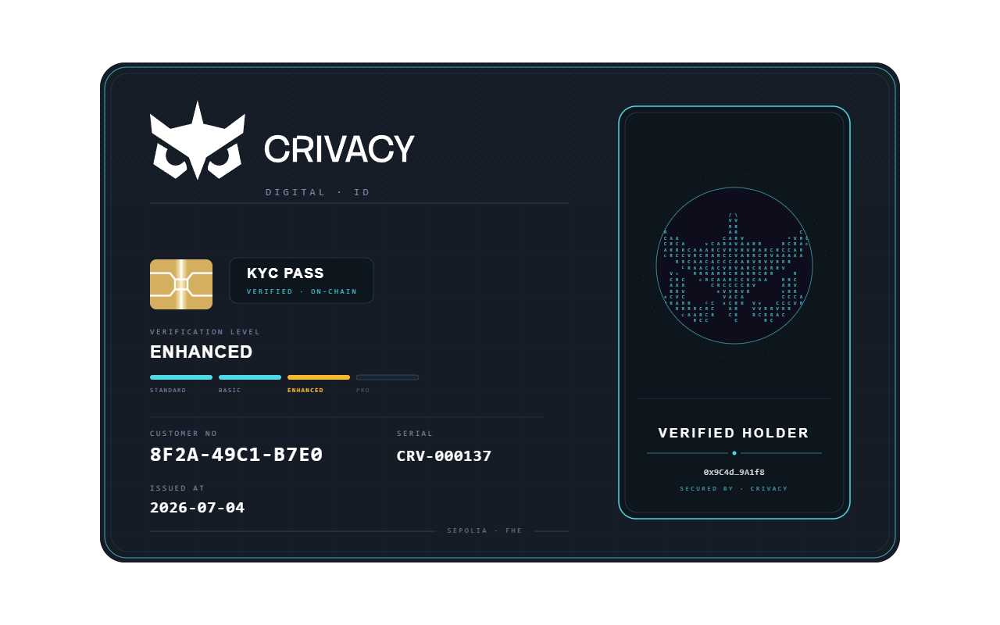</td>
<td align="center">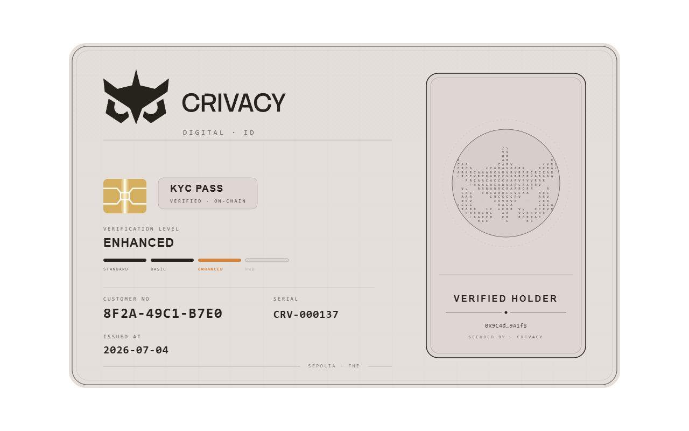</td>
</tr>
<tr>
<td align="center"><em>Dark theme</em></td>
<td align="center"><em>Light theme</em></td>
</tr>
</table>
</div>

<br/>

## Credential lifecycle

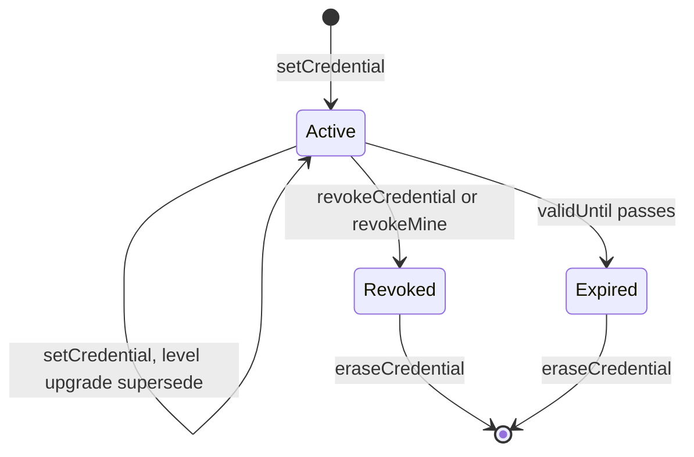

<br/>

## For firms

Integration is one button and one OAuth client. A firm never runs a KYC session, never stores a
document, and never asks a returning user to verify again.

| The firm receives | The firm never receives |
|---|---|
| An encrypted yes or no eligibility verdict | Passport or ID images |
| The on-chain pointer to read the credential itself | Selfie or face match images |
| The proof hash and validity window | Full name, date of birth, document number |
| The level that was granted | Home address text |
| Only the fields the user approved | The raw humanity score, unless granted |

<!-- MEDIA SLOT 4 — TEST FIRM AFTER APPROVAL, file: docs/media/firm-approved.png -->
<div align="center">
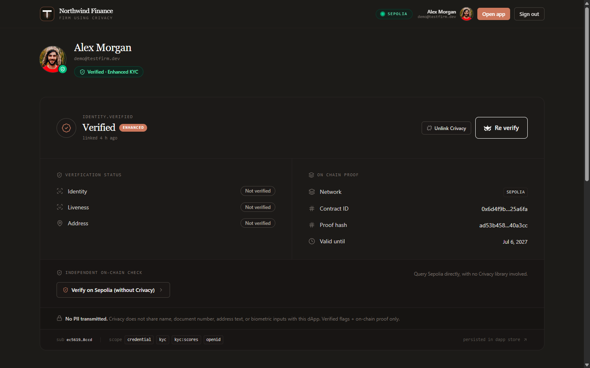
<br/><em>A firm that integrated Crivacy. The user proved their KYC in seconds, no document re-uploaded.</em>
</div>

<br/>

## OAuth, the user, firm, and Crivacy

A firm never holds a password for the user and never runs KYC. The link is a standard OAuth 2.1
handoff with one on-chain step Crivacy adds. Solid arrows are live today. The dashed arrows are
the per-firm encrypted verdict, wired in the contract and SDK and switched on per integration.

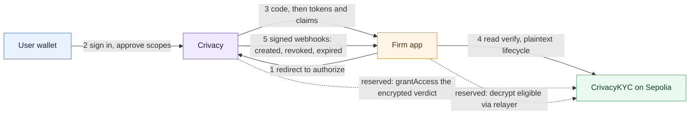

The firm drops in one button, in any language. The same snippet ships in the docs and in the
dashboard quickstart, and Crivacy delivers signed webhooks for every credential lifecycle event.

<!-- =========================================================
     MEDIA SLOT 8 and 9 — DASHBOARD VIEW CODE + CONSENT SCREEN
     Files: docs/media/dashboard-viewcode.png and docs/media/oauth-consent.png
     Left: the integration snippets modal from the firm dashboard.
     Right: the Crivacy consent screen the user approves.
     ========================================================= -->
<div align="center">
<table>
<tr>
<td align="center">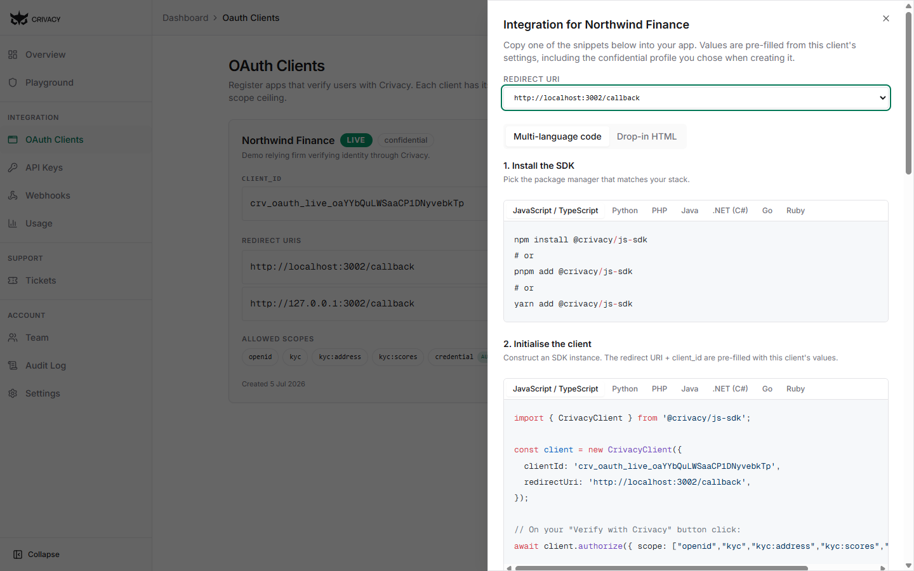</td>
<td align="center">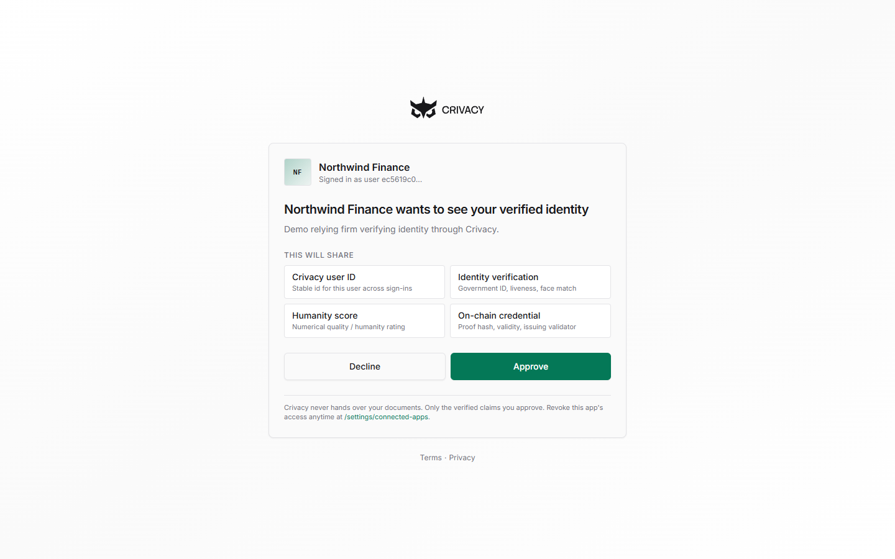</td>
</tr>
<tr>
<td align="center"><em>One button, any stack, straight from the dashboard</em></td>
<td align="center"><em>The user approves exactly what the firm may see</em></td>
</tr>
</table>
</div>

<br/>

## Trustless verification

The firm does not have to trust a Crivacy API response. The OAuth claims carry a pointer to the
credential on chain, `fhe_kyc_user_address` and `fhe_kyc_contract`. The firm reads the credential
itself and decrypts only the verdict it was granted.

```ts
import { CrivacyClient, verifyDisclosure } from '@crivacy/js-sdk';
import { createPublicClient, http, keccak256, toBytes } from 'viem';
import { sepolia } from 'viem/chains';

const crivacy = new CrivacyClient({
  clientId: process.env.CRIVACY_CLIENT_ID!,
  clientSecret: process.env.CRIVACY_CLIENT_SECRET!,
  redirectUri: 'https://your.app/oauth/callback',
});

// After the OAuth flow you hold the claims.
const view = await verifyDisclosure(claims, {
  publicClient: createPublicClient({ chain: sepolia, transport: http() }),
});

// status, isActive, and validUntil are plaintext on chain. Gate on isActive.
if (!view.isActive) throw new Error('Credential not active on chain');

// userRefHash binds the credential to the user you expect.
if (view.userRefHash.toLowerCase() !== keccak256(toBytes(claims.sub)).toLowerCase()) {
  throw new Error('Credential bound to a different user');
}

// The sensitive fields stay encrypted. A granted firm decrypts the eligible
// handle with the Zama SDK. Everyone else sees ciphertext.
```

<!-- MEDIA SLOT 5 — INDEPENDENT VERIFY RESULT, file: docs/media/firm-verify.png -->
<div align="center">
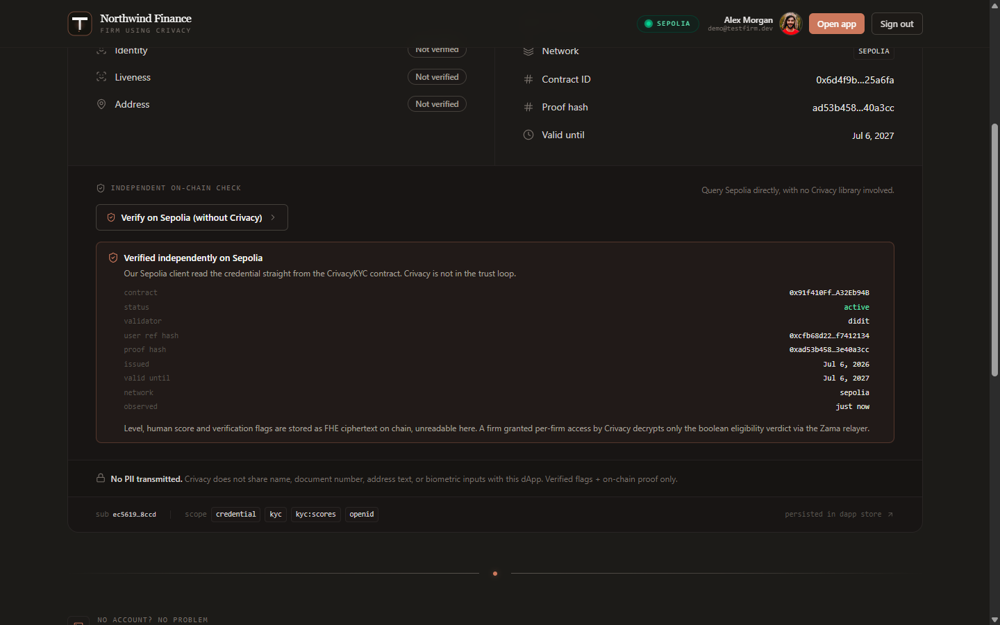
<br/><em>The firm reads the verdict from CrivacyKYC on Sepolia with its own node. Trusted because it comes from the chain, not from our API.</em>
</div>

<br/>

## Smart contracts

Deployed on Sepolia. Contract source: `CrivacyKYC` (crivacy-kyc-v2). Click an address to open it on Etherscan.

| Contract | Address (Sepolia) | Env var | Role |
|---|---|---|---|
| CrivacyKYC | [`0x91f410FfCF51abd0389890968b243bb9A32Eb94B`](https://sepolia.etherscan.io/address/0x91f410FfCF51abd0389890968b243bb9A32Eb94B) | `FHE_KYC_ADDRESS` | Encrypted credential registry, keyed by wallet |
| CrivacyKycNFT | [`0x27A9E3DED8a97cC31F451302Fc069b42A72F602a`](https://sepolia.etherscan.io/address/0x27A9E3DED8a97cC31F451302Fc069b42A72F602a) | `FHE_NFT_ADDRESS` | Soulbound proof of a live credential |

Selected functions on CrivacyKYC:

| Function | Caller | Purpose |
|---|---|---|
| `setCredential(...)` | operator | Issue or supersede a credential, encrypting the six sensitive fields in one bundle |
| `verify(user)` | anyone | Read the full view; plaintext fields open, encrypted handles decrypt only for granted addresses |
| `myCredential()` | holder | The holder reads their own credential from their wallet |
| `grantAccess(user, firm, minLevel)` | operator | Add a firm to the eligible handle, gated at a minimum level |
| `revokeAccess(user, firm)` | operator | Reset a firm's grant to an empty handle |
| `revokeCredential(user, burnNft)` | operator | Revoke and optionally burn the bound NFT |
| `revokeMine()` | holder | The holder revokes their own credential |
| `eraseCredential(user)` | operator | Delete the on-chain row for erasure requests |

<br/>

## Security

Encryption is the headline; the platform is built defensively at every layer.

* **No personal data on chain.** Only ciphertext handles and hashes. Raw documents stay with the
  licensed provider under a data processing agreement, never with relying firms.
* **Access is explicit and revocable.** A firm decrypts a verdict only after the user grants it,
  only for that firm, and only until the grant is reset.
* **OAuth 2.1 with PKCE.** Exact match redirect URIs, single use authorization codes that expire
  in sixty seconds, argon2id hashed client secrets.
* **One validation rule, both sides.** Frontend and backend import the same schemas, so a check
  cannot pass in the browser and fail on the server or the reverse.
* **Row level security in Postgres.** Firm scoped and customer scoped pools are isolated at the
  database, not only in application code.
* **Rate limiting and audit logging on every mutation**, with lockouts on anything a caller
  could guess.

<br/>

## Tech stack

| Layer | Choice |
|---|---|
| Encryption | Zama FHEVM, relayer based encryption and decryption |
| Contracts | Solidity on Sepolia, viem for reads and writes |
| Web | Next.js 15 App Router, TypeScript in strict mode |
| Data | PostgreSQL with Drizzle and row level security |
| Identity provider | Licensed KYC vendor for document, liveness, face match, and address |
| Monorepo | pnpm workspaces and Turborepo |

<br/>

## Repository layout

```text
apps/
  web/         Next.js app: customer flow, firm dashboard, OAuth, API, docs
  landing/     Marketing site
  test-firm/   A sample relying firm that integrates Verify with Crivacy
packages/
  js-sdk/            CrivacyClient and verifyDisclosure for firms
  fhe-credential/    Zama FHEVM client, contract ABIs, credential encode and decode
  fhe-adapter-didit/ Adapter for the KYC provider
  shared-types/      Types shared across apps and packages
fhevm/
  contracts/         CrivacyKYC.sol and CrivacyKycNFT.sol
```

<br/>

## Getting started

```bash
pnpm install
cp apps/web/.env.example apps/web/.env   # fill in the FHE and provider keys
pnpm dev                                  # web on http://127.0.0.1:3001
pnpm typecheck
pnpm test
```

Requirements: Node 22 LTS, pnpm 9, PostgreSQL 16, and Docker for the local database and the
cross service integration tests.

<br/>

## License

Proprietary. All rights reserved.
