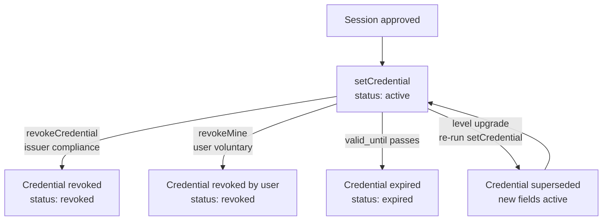

## What are re-usable credentials?

When a user passes KYC verification through Crivacy, a **credential** is created. This credential is:

- **Anchored on Sepolia**, the `CrivacyKYC` smart contract stores the credential's proof hash and lifecycle, making it tamper-evident and independently verifiable.
- **Encrypted end-to-end**, the sensitive fields (level, humanity score, verification flags, eligibility verdict) live on chain as Zama FHEVM ciphertext handles, not plaintext. Only the user (and firms the user granted access to) can decrypt them.
- **Re-usable across firms**, once a user verifies their identity, any firm the user consents to can read the existing credential instead of asking the user to verify again. **Verify once, use everywhere.**
- **Privacy-preserving**, a firm receives only the encrypted eligibility verdict it was granted, never the raw personal data or documents.
- **Free for end users**, users never pay for verification or credential usage.

---

## Credential fields

The credential's on-chain `CredentialView` splits into plaintext lifecycle metadata and encrypted (FHE) fields.

| Field | Type | Visibility | Description |
|-------|------|-----------|-------------|
| `id` | string | plaintext | Unique credential identifier (e.g., `cred_x7y8z9w6`). |
| `user_ref` | string | plaintext | Your firm's unique reference for the user. |
| `status` | string | plaintext | Current status: `active`, `revoked`, or `superseded` (for credentials replaced by a level upgrade). |
| `chain_contract_id` | string | plaintext | The Sepolia transaction hash that wrote this credential to the `CrivacyKYC` contract. |
| `proof_hash` | string | plaintext | SHA-256 hash of the verification proof, recorded on chain as `bytes32`. |
| `valid_until` | string (ISO 8601) | plaintext | Credential expiration date (typically 1 year from issuance). |
| `validator` | string | plaintext | Verification provider: `DiditValidator` (or `ZkValidator` on the roadmap). |
| `level` | string | **encrypted** | Verification level: `basic` (identity + liveness) or `enhanced` (adds proof of address). |
| `human_score` | number | **encrypted** | Humanity / liveness confidence score. |
| `identity_verified` | boolean | **encrypted** | Whether government ID verification passed. |
| `liveness_verified` | boolean | **encrypted** | Whether liveness detection passed. |
| `address_verified` | boolean | **encrypted** | Whether proof-of-address verification passed (Enhanced level). |
| `eligible` | boolean | **encrypted** | The composite yes/no verdict a firm decrypts once granted access. |
| `created_at` | string (ISO 8601) | plaintext | When the credential was created. |
| `updated_at` | string (ISO 8601) | plaintext | When the credential was last modified. |

> **Encrypted fields** are stored on chain as ciphertext handles (`euint8` / `ebool`). They never leave the chain in the clear. The user decrypts their own via the Zama relayer with their wallet; a firm decrypts only the `eligible` handle after the user grants it per-firm ACL access. Crivacy (the operator) holds issuer ACL so it can power the server-side verify endpoint, but never exposes the plaintext without the user's consent.

---

## Credential lifecycle



| Status | Meaning |
|--------|---------|
| `active` | The credential is valid and can be disclosed to firms the user consents to. |
| `revoked` | The credential has been revoked (issuer compliance via `revokeCredential`, user-voluntary via `revokeMine`, or a fraud cascade). Revocation is on-chain and permanent, and burns the bound soulbound NFT atomically when requested. |
| `expired` | The credential's `valid_until` timestamp has passed. `isActive` on chain flips false past the window, consumers MUST treat an out-of-window credential as invalid. |
| `superseded` | The credential was upgraded in place (basic → enhanced after proof-of-address). `setCredential` re-runs with the new encrypted fields under the same wallet key; the prior values are overwritten on chain. |

> **Expiration:** `validUntil` is a plaintext `uint64` on the `CredentialView`. The contract's `isActive` flag is computed against it, once it has passed the credential reads as inactive. Consumers should always gate on `isActive` (or compare `valid_until` to the current time) regardless of `status`.

> **Revocation:** When a credential is revoked, the `CrivacyKYC` contract executes `revokeCredential(user, burnNft)`, making the revocation tamper-evident and auditable, and burning the soulbound `CrivacyKycNFT` in the same transaction when `burnNft` is set.

---

## Fetching a credential

**Endpoint:** `GET /api/v1/credentials/:userRef`

**Required scope:** `kyc:read`

Returns the most recent credential for the given user reference. The encrypted fields come back as ciphertext handles unless your firm holds decrypt access.

### cURL

```curl
curl https://api.crivacy.io/api/v1/credentials/user_8x7k2m \
  -H "x-api-key: crv_live_a1b2c3d4e5f6..."
```

### JavaScript

```javascript
const credential = await fetch(
  'https://api.crivacy.io/api/v1/credentials/user_8x7k2m',
  { headers: { 'x-api-key': process.env.CRIVACY_API_KEY } }
).then((r) => r.json());
```

### Python

```python
import requests, os

credential = requests.get(
    "https://api.crivacy.io/api/v1/credentials/user_8x7k2m",
    headers={"x-api-key": os.environ["CRIVACY_API_KEY"]},
).json()
```

### Response (200 OK)

```json
{
  "id": "cred_x7y8z9w6",
  "user_ref": "user_8x7k2m",
  "status": "active",
  "level": "enhanced",
  "proof_hash": "e3b0c44298fc1c149afbf4c8996fb924...",
  "chain_contract_id": "0x91f410ffcf51abd0389890968b243bb9a32eb94b...",
  "valid_until": "2027-04-12T00:00:00Z",
  "human_score": 97,
  "identity_verified": true,
  "liveness_verified": true,
  "address_verified": true,
  "validator": "DiditValidator",
  "created_at": "2026-04-12T12:03:45Z",
  "updated_at": "2026-04-12T12:03:45Z"
}
```

> The encrypted fields (`level`, `human_score`, the verification flags) are returned decrypted here only because the API key holder is scoped for `kyc:read` on credentials it issued. For a trustless read that bypasses Crivacy entirely, see [Disclosure to third parties](#disclosure-to-third-parties) below.

---

## Credential history

**Endpoint:** `GET /api/v1/credentials/:userRef/history`

**Required scope:** `kyc:read`

Returns the audit trail of all events related to a user's credentials, including creation, verification checks by third parties, and revocation.

### cURL

```curl
curl https://api.crivacy.io/api/v1/credentials/user_8x7k2m/history \
  -H "x-api-key: crv_live_a1b2c3d4e5f6..."
```

### Response (200 OK)

```json
{
  "data": [
    {
      "action": "credential.created",
      "credential_id": "cred_x7y8z9w6",
      "timestamp": "2026-04-12T12:03:45Z",
      "details": {
        "level": "enhanced",
        "chain_contract_id": "0x91f410ffcf51abd0389890968b243bb9a32eb94b..."
      }
    },
    {
      "action": "credential.verified",
      "credential_id": "cred_x7y8z9w6",
      "timestamp": "2026-04-13T09:15:00Z",
      "details": {
        "verifier_firm": "Acme Corp",
        "result": true
      }
    }
  ],
  "pagination": {
    "next_cursor": null,
    "has_more": false
  }
}
```

---

## Disclosure to third parties

One of Crivacy's core features is **credential disclosure**, allowing a verified user's credential to be shared with another firm without repeating the full KYC process.

### How disclosure works

1. During the OAuth consent, the user grants **Firm B** access. Crivacy calls `grantAccess(user, firm, minLevel)` on the `CrivacyKYC` contract, giving Firm B's address per-firm ACL permission to decrypt the encrypted `eligible` verdict.
2. Crivacy ships the on-chain pointer to Firm B in the OAuth claims: `fhe_kyc_user_address` (the subject's EVM address, the key of their credential) and `fhe_kyc_contract` (the `CrivacyKYC` registry address on Sepolia).
3. Firm B reads the credential straight from the contract on **its own Ethereum node** using `@crivacy/js-sdk`'s [`verifyDisclosure()`](/docs/oauth#verify-the-disclosure-on-chain) helper, Crivacy is not in the trust loop. The endpoint below is a server-side convenience for clients that don't run their own node.

> **Trustless path: use `verifyDisclosure()` from `@crivacy/js-sdk`.** The OAuth flow already ships the on-chain pointer to firms; the SDK exposes a one-line wrapper that reads the `CrivacyKYC` contract's `verify(user)` view with your own viem client. The plaintext lifecycle (`status`, `isActive`, `validUntil`, `userRefHash`) comes back verbatim from chain state, and the granted firm decrypts the `eligible` ciphertext handle with the Zama SDK. Crivacy can never lie about the credential's state. See [OAuth → Verify the disclosure on chain](/docs/oauth#verify-the-disclosure-on-chain) for the full example.

### Verifying a disclosure (Crivacy-side convenience)

> ⚠ **This endpoint runs the read on Crivacy's node**, so it puts Crivacy back in the trust loop. Use it only when running your own Ethereum node isn't yet feasible (early prototype, internal admin tools). For production firm integrations, prefer `verifyDisclosure()` from `@crivacy/js-sdk` so the read happens on your side and Crivacy can never lie about the credential's state.

**Endpoint:** `POST /api/v1/credentials/verify`

**Required scope:** `kyc:verify`

```curl
curl -X POST https://api.crivacy.io/api/v1/credentials/verify \
  -H "Content-Type: application/json" \
  -H "x-api-key: crv_live_a1b2c3d4e5f6..." \
  -d '{
    "user_address": "0x1234abcd...",
    "contract": "0x91f410ffcf51abd0389890968b243bb9a32eb94b"
  }'
```

### Response (200 OK)

```json
{
  "valid": true,
  "credential_id": "cred_x7y8z9w6",
  "user_ref": "user_8x7k2m",
  "status": "active",
  "level": "enhanced",
  "valid_until": "2027-04-12T00:00:00Z",
  "identity_verified": true,
  "liveness_verified": true,
  "address_verified": true,
  "verified_at": "2026-04-13T09:15:00Z"
}
```

If the credential is missing, expired, or revoked:

```json
{
  "valid": false,
  "reason": "credential_revoked",
  "credential_id": "cred_x7y8z9w6"
}
```

---

## On-chain details

Each credential is a row in the `CrivacyKYC` contract on Sepolia, keyed by the user's EVM address, with the following `CredentialView` structure:

| Field | Visibility | Description |
|---|---|---|
| `userRefHash` | plaintext `bytes32` | keccak256 of your firm's user reference, binds the on-chain credential to the OIDC subject. |
| `proofHash` | plaintext `bytes32` | Commitment to the Didit-returned identity fields at mint time. |
| `status` / `isActive` | plaintext | Lifecycle enum + a computed active flag (false past `validUntil` or after revoke). |
| `validator` | plaintext | The verification provider enum (`DiditValidator`). |
| `validUntil` / `issuedAt` | plaintext `uint64` | Validity window timestamps. |
| `level` / `humanScore` | **encrypted** `euint8` | Verification level + humanity score ciphertext handles. |
| `identityVerified` / `livenessVerified` / `addressVerified` / `sanctioned` | **encrypted** `ebool` | Per-check ciphertext handles. |
| `eligible` | **encrypted** `ebool` | Composite verdict a granted firm decrypts via the Zama relayer. |

The contract exposes the following functions:

- **`verify(user)`** (view), returns the full `CredentialView` for any user; plaintext fields are readable by anyone, encrypted handles decrypt only for addresses holding ACL access.
- **`myCredential()`** (view), the user reads their own credential from their wallet.
- **`grantAccess(user, firm, minLevel)`** / **`revokeAccess(user, firm)`** (operator), open or close a firm's per-firm decrypt access to the `eligible` verdict.
- **`setCredential(...)`** (operator), issue or supersede a credential; encrypts the six sensitive fields in one relayer bundle before writing.
- **`revokeCredential(user, burnNft)`** (operator) / **`revokeMine()`** (user), revoke the credential; burns the bound soulbound NFT atomically when `burnNft` is set.
- **`eraseCredential(user)`** (operator), GDPR erasure, deletes the on-chain row entirely.

> **Note:** All write operations are performed and paid for by Crivacy's backend (the contract `operator`). Firms interact through the REST API + OAuth flow and never need to send a transaction, except when they choose the trustless verification path with `verifyDisclosure()` on their own node, which is a read and costs no gas.

---

## Next steps

- [OAuth / OIDC integration](/docs/oauth), request credential claims during the user consent flow.
- [Webhooks](/docs/webhooks), get notified when credentials are created, verified, or revoked.
- [API reference](/docs/api-reference), full endpoint documentation.
