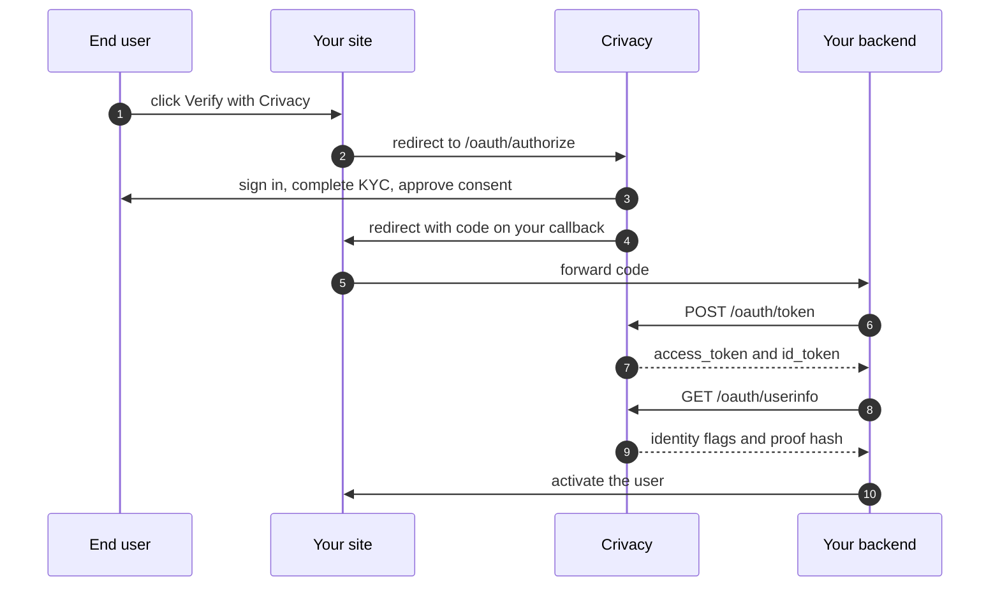

## What is Crivacy?

Crivacy is a FHE-powered, re-usable KYC credential platform. You add a **Verify with Crivacy** button to your site; your users verify their identity once on our hosted consent flow and every participating firm can re-use that credential afterwards, **verify once, use everywhere.**

Key benefits for firms:

- **Low friction onboarding**, returning users skip repeated ID checks.
- **On-chain proof**, every credential is anchored on the Sepolia, providing cryptographic tamper-evidence.
- **Privacy-preserving**, firms receive boolean verification flags and a proof hash. The raw ID photo, selfie, name, and date of birth never leave Crivacy's infrastructure.
- **Standard OAuth 2.0 / OIDC**, any OpenID-compliant library on your side works unchanged. We also ship first-party SDKs for **JavaScript / TypeScript, Python, PHP, Java, .NET, Go, and Ruby** so the integration feels native to your stack.

---

## Prerequisites

Before you begin, make sure you have:

1. A **Crivacy firm account**. Sign up at the [dashboard](/dashboard).
2. A **registered OAuth client**. Create one at **Dashboard → Settings → OAuth Clients**. You'll receive a `client_id` (and, for confidential clients, a `client_secret` shown once).
3. A **callback URL** on your site (e.g. `https://your.app/oauth/callback`) that you've added to the client's redirect-URI whitelist.

> **Use a `test`-mode client during development.** Test-mode requests run against a sandbox and never touch the production Sepolia ledger. Switch the client to `live` when you deploy.

---

## Choosing a client type

Crivacy supports two OAuth client profiles. The right one depends on where your code runs:

- **Confidential client**, your server holds a `client_secret` and performs the token exchange. Use this for any integration with a backend (Node, Python, PHP, Java, .NET, Go, Ruby).
- **Public client (PKCE only)**, no `client_secret` exists. Required for browser-only SPAs, React Native, native mobile, and CLI tools. PKCE (`code_verifier` + `code_challenge`) replaces the secret and proves the same redirect originated the request.

Every code sample in this guide has a **Public client (PKCE only)** toggle next to the language tabs, flip it to see the snippet adjust for either profile.

---

## The full flow



---

## Step 1: Add the Verify button

The fastest path is the **drop-in button**, works on any HTML page, no bundler required, no install:

```html
<link rel="stylesheet" href="https://app.crivacy.io/assets/crivacy/v1/button.css">
<script src="https://app.crivacy.io/assets/crivacy/v1/crivacy.js" defer></script>

<button
  class="crivacy-button"
  data-crivacy-verify
  data-client-id="crv_oauth_live_xxxxxxxxxxxxx"
  data-redirect-uri="https://your.app/oauth/callback"
  data-scope="openid kyc">
  <svg class="crivacy-button__icon" viewBox="0 0 200 168.71" fill="currentColor" aria-hidden="true">
    <path d="M16.06,90.54c6.97,4.17,13.94,8.33,20.91,12.5-.73,1.32-1.64,3.18-2.39,5.53,0,0-.76,2.87-1.21,5.5-.6,3.54-.15,11.95,6.17,17.95,5.82,5.52,14.23,6.72,19.82,4.78,3.73-1.29,7.07-3.4,8-4.09,2.26-1.67,3.88-3.41,4.96-4.72,1.5,2.17,3.58,5.79,4.61,10.69.64,3.07.68,5.76.55,7.82-7.85,6.31-15.7,12.62-23.55,18.93l-46.87-30.98,9-43.92Z"/>
    <path d="M182.89,90.54c-6.97,4.17-13.94,8.33-20.91,12.5.73,1.32,1.64,3.18,2.39,5.53,0,0,.76,2.87,1.21,5.5.6,3.54.15,11.95-6.17,17.95-5.82,5.52-14.23,6.72-19.82,4.78-3.73-1.29-7.07-3.4-8-4.09-2.26-1.67-3.88-3.41-4.96-4.72-1.5,2.17-3.58,5.79,4.61,10.69-.64,3.07-.68,5.76-.55,7.82,7.85,6.31,15.7,12.62,23.55,18.93l46.87-30.98-9-43.92Z"/>
    <polygon points="200 28.52 195.87 69.04 118.25 120.34 100 168.71 81.75 120.34 4.13 69.04 0 28.52 42.65 60.42 87.65 49.66 100 0 112.35 49.66 157.35 60.42 200 28.52"/>
  </svg>
  <span class="crivacy-button__label">Verify with Crivacy</span>
</button>
```

On click the snippet generates a PKCE verifier + `state` value, stores them in `sessionStorage`, then redirects the current tab to `https://app.crivacy.io/api/v1/oauth/authorize?…`.

### Or use the language SDK

For SPAs, mobile apps, server-side renderers, or backend-driven flows, install the **first-party SDK** in your language:

<MultiLangSnippet step="install" />

Then construct a client and trigger the redirect on your Verify button:

<MultiLangSnippet step="init" />

---

## Step 2: Handle the callback

Crivacy redirects the user back to your registered URL with a one-time `code` and the echoed `state`:

```
https://your.app/oauth/callback?code=abc123&state=<original-state>
```

On that route, verify `state` matches the value you generated in Step 1, then exchange the code for tokens. Pick your stack, every tab below produces the same wire-level `POST /oauth/token` exchange, idiomatic for the language:

<MultiLangSnippet step="callback" />

The **Public client (PKCE only)** toggle flips the snippet between confidential (`client_secret` from env) and public (PKCE `code_verifier` only) profiles. See [OAuth / OIDC integration](/docs/oauth) for the full token-exchange schema.

---

## Step 3: Read the verification claims

Once you have an `access_token`, fetch the claim set from `/oauth/userinfo`:

<MultiLangSnippet step="userinfo" />

The response is a flat object. Crivacy **always** includes the on-chain reference (proof hash + contract id + on-chain pointer) whenever you request any `kyc*` scope, `credential` is a [companion scope](#companion-scope) auto-attached server-side, so a firm that takes a verification claim from Crivacy can always verify it independently on-chain:

```json
{
  "sub": "cus_9f8e7d6c",
  "identity_verified": true,
  "liveness_verified": true,
  "credential_proof_hash": "sha256:e3b0c44298fc1c149afbf4c8996fb924...",
  "credential_level": "enhanced",
  "credential_valid_until": "2027-04-12T00:00:00Z",
  "credential_network": "sepolia",
  "credential_contract_id": "0x91f410ffcf51abd0389890968b243bb9a32eb94b...",
  "fhe_kyc_user_address": "0x1234abcd...",
  "fhe_kyc_contract": "0x91f410FfCF51abd0389890968b243bb9A32Eb94B"
}
```

### Field reference

| Field | Type | What it is |
|---|---|---|
| `sub` | string | Crivacy user id, stable per OAuth client. Granted by `openid`. |
| `identity_verified` | boolean | Government ID + face match passed. Granted by `kyc`. |
| `liveness_verified` | boolean | Live person, not a deepfake / photo / replay. Granted by `kyc`. |
| `address_verified` | boolean | Proof-of-address passed. Granted by `kyc:address`. |
| `humanity_score` | number 0–100 | Composite quality / liveness signal. Granted by `kyc:scores`. |
| `credential_proof_hash` | string | SHA-256 of the verification proof, anchored on Sepolia. Always present with `kyc*`. |
| `credential_level` | enum | `basic` / `enhanced`, the level of the active credential. |
| `credential_valid_until` | ISO 8601 | When the credential expires. Verifiers compare this timestamp against the current time (or read `isActive` from the contract) and treat any out-of-window credential as invalid. |
| `credential_network` | string | `sepolia` for the current deployment. |
| `credential_contract_id` | string | The Sepolia transaction reference for the credential write. |
| `fhe_kyc_user_address` | string | The subject's EVM address, the key of their credential in the `CrivacyKYC` contract. |
| `fhe_kyc_contract` | string | **The `CrivacyKYC` registry address on Sepolia. Pass the claims to `@crivacy/js-sdk`'s [`verifyDisclosure()`](/docs/oauth#verify-the-disclosure-on-chain) helper with your own viem client to read the credential straight from the contract, one function call, no ABI to hand-write.** This is the part that makes Crivacy non-custodial: you don't have to trust our boolean flags, verification happens on chain. |

See [OAuth scopes](/docs/oauth#scopes) for which scope unlocks which field set.

### Companion scope

`credential` is treated as a **companion scope**: any time you request `kyc`, `kyc:address`, or `kyc:scores`, the server attaches `credential` to the granted scope set automatically (`apps/web/src/lib/oauth/scopes.ts::expandImplicitScopes`). You don't need to add `credential` to your `?scope=` query, but seeing it on the consent screen is normal, and the user does see "on-chain reference" listed there. The reason is intentional: a firm that holds a Crivacy KYC claim **without** the on-chain reference would have no way to audit the claim independently, which defeats the whole point of the product.

---

## What the firm sees vs. doesn't see

Crivacy ships **boolean flags and hashes**, never raw PII:

| Firm receives | Firm does NOT receive |
|---|---|
| `identity_verified: true` | Scanned ID photo |
| `liveness_verified: true` | Selfie / face-match image |
| `address_verified: true` (only with `kyc:address`) | Name, date of birth, document number |
| `humanity_score: 92` (only with `kyc:scores`) | Utility-bill photo |
| `credential_proof_hash`, chain-anchored hash | Home address text |
| `credential_contract_id`, on-chain contract reference | Didit session id |
| `fhe_kyc_user_address` + `fhe_kyc_contract`, on-chain pointer for independent verification | Raw biometric / document images |

The raw documents are captured by Didit under Crivacy's data-processing agreement and stored only as encrypted evidence. Your firm is a **recipient of verification signals**, not a controller of identity data, which typically places you outside the heaviest GDPR / KVKK data-controller categories for this flow.

---

## What can go wrong

The consent page gracefully handles every common failure path:

- **User has no Crivacy account** → login page bounce with a "Sign up" link → resumes on the consent page after sign-in.
- **User hasn't completed KYC** → "Verification required" screen with a one-click Start button, then resumes on the consent page once the credential is issued.
- **User cancels mid-flow** → your callback receives `?error=access_denied&state=<original>`. Show a retry affordance.
- **Verification link expires (15 min)** → user sees a "Link expired" screen asking them to click your Verify button again.
- **Firm requests a higher level than the user has** (e.g. asking for `kyc:address` when they only have a Basic credential) → "Additional verification required" screen with the upgrade flow.

---

## Next steps

- [OAuth / OIDC integration](/docs/oauth), full flow, scopes, security model, interop.
- [Authentication](/docs/authentication), API-key format + scopes for the `/api/v1/credentials` and `/api/v1/webhooks` management endpoints.
- [Credentials](/docs/credentials), the credential schema, lifecycle, and re-use semantics.
- [Webhooks](/docs/webhooks), event types (`credential.*`, `kyc.session.*`, `oauth.consent.*`), signing, retries.
- [Error codes](/docs/error-codes), complete error reference.
- [Rate limits](/docs/rate-limits), per-tier quotas.
- [API reference](/docs/api-reference), auto-generated endpoint documentation.
