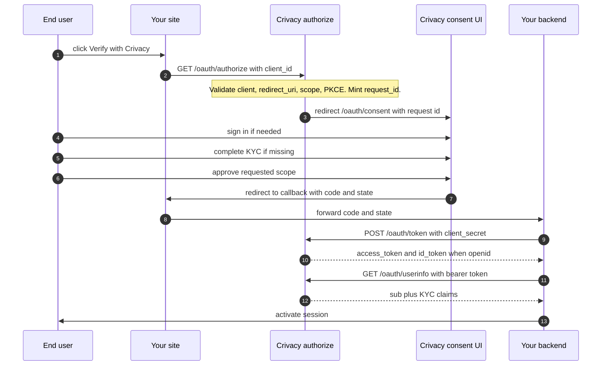

## Overview

Crivacy exposes its KYC credential layer as an **OAuth 2.0 authorization-code + OpenID Connect provider**. When a user lands on your site and you want to verify their identity, you redirect them to Crivacy. They sign in (or sign up), complete any missing KYC step, approve the disclosure, and Crivacy hands the browser back to you with a one-time code. Your backend exchanges the code for an access token and reads the identity claims from `/userinfo`.

The flow is identical to "Sign in with Google" or "Connect with Stripe", with one extra step: if the user hasn't completed KYC yet, Crivacy walks them through it before showing the consent screen. The attack surface, library stories, and error codes are the ones OAuth-literate developers already know.

> **OAuth is the public integration surface.** The `POST /api/v1/sessions` endpoint is an internal, advanced primitive used by the Crivacy customer portal and is not part of the firm-facing contract. New integrations go through OAuth; the browser-initiated flow covers every onboarding, upgrade, and re-verify case.

---

## When to use this

Use OAuth when you want to:

- Add a "Verify with Crivacy" button to your signup or account flow.
- Gate access to a feature on KYC level (e.g. "address verified").
- Read a user's credential proof hash for on-chain verification.

Anything else (raw API calls, server-to-server batch jobs) uses the plain API key flow, but those use cases are rare; 95% of integrations are browser-initiated.

---

## Endpoints

| Endpoint | Purpose |
|---|---|
| `GET /api/v1/oauth/authorize` | Where you redirect the user. Crivacy handles login, KYC, consent. |
| `POST /api/v1/oauth/token` | Exchange the one-time code for an access token + id_token. |
| `GET /api/v1/oauth/userinfo` | Read the user's claim set with the access token. |
| `POST /api/v1/oauth/consent` | Internal, used by the Crivacy consent page. Don't call this. |

---

## Flow



---

## Quick start

### 1. Register a client

Head to **Dashboard → Settings → OAuth Clients → New client**. Provide:

- **Name** shown to users on the consent screen.
- **Redirect URIs**, exact-match whitelist. `https://your.app/oauth/callback` style.
- **Scopes**, the maximum your client will ever request. See [Scopes](#scopes).
- **Mode**, `test` for development, `live` for production.
- **Public vs confidential**, tick *public* for SPAs/mobile (PKCE required, no secret).

On save you'll see the `client_id` and, for confidential clients, the raw `client_secret`. **Save the secret immediately.** Crivacy never shows it again.

### 2. Redirect the user

From your site, send the user to:

```
https://app.crivacy.io/api/v1/oauth/authorize
  ?response_type=code
  &client_id=crv_oauth_live_xxxxxxxxxxxxx
  &redirect_uri=https://your.app/oauth/callback
  &scope=openid+kyc
  &state=<random-per-session-csrf-token>
```

Public clients add PKCE:

```
  &code_challenge=<S256(verifier)>
  &code_challenge_method=S256
```

### 3. Handle the callback

On your registered callback route, verify the `state` echoes what you stored, then exchange the one-time code for tokens. The **Public client (PKCE only)** toggle on the snippet flips between the confidential profile (`client_secret` from env) and the public profile (PKCE `code_verifier` only):

<MultiLangSnippet step="callback" />

If the callback URL carries `?error=access_denied`, `?error=invalid_scope`, etc. instead of `?code=…`, jump to [Error codes](#error-codes) for the recovery shape.

### 4. Read the claims

<MultiLangSnippet step="userinfo" />

The claim set is keyed by the scopes you requested, see the [Scopes](#scopes) catalog below for what each scope unlocks.

<h3 id="verify-the-disclosure-on-chain">5. Verify the disclosure on chain</h3>

The `credential` companion scope ships an on-chain pointer alongside the claims: `fhe_kyc_user_address` (the subject's EVM address, the key of their credential) and `fhe_kyc_contract` (the `CrivacyKYC` registry address on Sepolia). Pass the claims to `@crivacy/js-sdk`'s `verifyDisclosure()` helper together with **your own** viem client, Crivacy is not in the trust loop for this step.

Under the hood the helper reads the credential straight from the `CrivacyKYC` contract on Sepolia with your client. The plaintext lifecycle fields (`status`, `isActive`, `validUntil`, `userRefHash`) come back verbatim from chain state, so you gate access on `isActive` without trusting our claim set. The sensitive fields (level, humanity score, verification flags, and the eligibility verdict) stay **encrypted** on chain as Zama FHEVM ciphertext handles; a firm Crivacy granted per-firm ACL access decrypts only the `eligible` handle with the Zama SDK, everyone else sees ciphertext.

```ts
import { CrivacyClient, verifyDisclosure } from '@crivacy/js-sdk';
import { createPublicClient, http, keccak256, toBytes } from 'viem';
import { sepolia } from 'viem/chains';

const crivacy = new CrivacyClient({
  clientId: process.env.CRIVACY_CLIENT_ID!,
  clientSecret: process.env.CRIVACY_CLIENT_SECRET!,
  redirectUri: 'https://your.app/oauth/callback',
});

// …complete the OAuth flow up to userinfo (Steps 1–4 above)…
const tokens = await crivacy.exchangeCode({ code, codeVerifier, redirectUri });
const claims = await crivacy.userinfo(tokens.access_token);

// Read the credential straight from the CrivacyKYC contract on
// Sepolia with YOUR OWN viem client. Crivacy is not in the trust
// loop, you trust the chain, not our API.
const view = await verifyDisclosure(claims, {
  publicClient: createPublicClient({ chain: sepolia, transport: http() }),
});

// `status` / `isActive` / `validUntil` are plaintext on-chain
// fields, no decryption. Gate access on `isActive`.
if (!view.isActive) {
  throw new Error('Credential not active on chain');
}

// Subject-binding: `userRefHash` is keccak256 of the user id we
// bound at mint time. Recompute it to confirm the credential is
// for the user you expect.
if (view.userRefHash.toLowerCase() !== keccak256(toBytes(claims.sub)).toLowerCase()) {
  throw new Error('Credential bound to a different user');
}

// The sensitive fields (level, score, verification flags, the
// eligibility verdict) stay ENCRYPTED on chain as ciphertext
// handles in `view.handles`. A firm Crivacy granted per-firm ACL
// access decrypts the `eligible` handle with the Zama SDK; these
// are what you gate access on, sourced from the chain, not from us.
```

If the claims don't carry the on-chain pointer (e.g. the user has no active credential, or `credential` was not in consent), `verifyDisclosure()` throws a `CrivacyError` with `code='fhe_kyc_user_address_missing'` / `'fhe_kyc_contract_missing'`. Chain-side failures (RPC unreachable, contract read revert) surface as the underlying viem error.

---

## Scopes

| Scope | Claims unlocked | Purpose |
|---|---|---|
| `openid` | `sub` | Required for OIDC. Gives you the Crivacy user id. |
| `kyc` | `identity_verified`, `liveness_verified` | Confirms ID + liveness + face match. |
| `kyc:address` | `address_verified` | Additionally confirms proof-of-address. |
| `kyc:scores` | `humanity_score` | Numeric humanity / quality signals (0–100). |
| `credential` *(companion)* | `credential_proof_hash`, `credential_level`, `credential_valid_until`, `credential_network`, `credential_contract_id`, `fhe_kyc_user_address`, `fhe_kyc_contract` | credential reference + on-chain pointer for independent verification. **Auto-attached** whenever any `kyc*` scope is requested, see below. |

Request the narrowest set that covers your use case. Users see exactly what you're asking for on the consent screen; asking for more than you need hurts conversion.

> **`credential` is a companion scope**, you do not need to include it explicitly. The authorize handler attaches it server-side (`expandImplicitScopes`) any time the request contains `kyc`, `kyc:address`, or `kyc:scores`. Crivacy's product position is "we are not the source of truth, the chain is", so every KYC disclosure ships with the on-chain pointer (`fhe_kyc_user_address` + `fhe_kyc_contract`) so the firm can read the credential straight from the `CrivacyKYC` contract on Sepolia and verify the claim independently on its own Ethereum node. Opting out of this would silently degrade the integration to Web2-trust mode, which we don't allow.

<h3 id="scope-openid">`openid`</h3>

Required. Enables OIDC mode: the `/token` response includes an
`id_token` and `sub` (the Crivacy user id, stable per client). No
KYC level prerequisite, you can identify users who have not
completed verification yet.

<h3 id="scope-kyc">`kyc`</h3>

Returns the core verification flags: `identity_verified` and
`liveness_verified`. Granted only if the user has a Basic-level
credential or higher. Use this scope when your UX needs to know
"is this a real, live person" without caring about address or
scoring.

<h3 id="scope-kyc-address">`kyc:address`</h3>

Adds `address_verified: true`. Granted only if the user has an
Enhanced-level credential, i.e. they completed the proof-of-
address workflow on top of identity + liveness. Use when your
flow requires regulated geographic context (licensing, tax
residency, shipping, etc.).

<h3 id="scope-kyc-scores">`kyc:scores`</h3>

Adds `humanity_score`, a numeric 0–100 signal summarising the
quality of the verification. Useful for gating UX features
(higher-trust users skip extra checks) without exposing raw
biometric data. No level prerequisite beyond what the user
already has; the score reflects the best credential on file.

<h3 id="scope-credential">`credential`</h3>

Returns the on-chain references plus the pointer needed to read
the credential yourself: `credential_proof_hash`, `credential_level`,
`credential_valid_until`, `credential_network`, `credential_contract_id`,
`fhe_kyc_user_address` (the subject's EVM address), and
`fhe_kyc_contract` (the `CrivacyKYC` registry address on Sepolia).
Use this when your backend wants to independently verify the
credential on Sepolia: read the contract straight with your own
viem client rather than trusting Crivacy's claim set. The
`@crivacy/js-sdk` SDK's `verifyDisclosure()` helper wraps this
whole flow, plaintext lifecycle in the clear, the sensitive fields
staying encrypted behind Zama FHEVM until you decrypt the granted
`eligible` verdict.

---

## Security

Crivacy implements the OAuth 2.1 baseline plus RFC 9700 best-current-practice:

- Exact-match `redirect_uri` only (no wildcards or prefix rules).
- `state` is echoed back byte-for-byte, validate it server-side to stop CSRF.
- Authorization codes expire after 60 seconds and are single-use; replay invalidates every token minted from the code.
- PKCE is **required** for public clients, optional but accepted for confidential ones.
- `client_secret` is argon2id-hashed at rest. If you suspect leakage, rotate it from the dashboard, the old hash is overwritten in the same transaction.

---

## Error codes

| Code | Meaning | How to handle |
|---|---|---|
| `invalid_request` | Malformed authorize parameters | Fix your redirect URL build. |
| `unauthorized_client` | Client is revoked or unknown | Check dashboard, client may have been disabled. |
| `invalid_scope` | Scope not in the client's allowed list | Add the scope to the client or request a subset. |
| `access_denied` | User pressed Decline | Show a retry affordance. |
| `invalid_grant` | Code expired, used, or belongs to another client | Restart the flow. |
| `invalid_client` | Bad client_secret or client_id | Rotate from dashboard if secret leaked. |
| `redirect_uri_mismatch` | URI doesn't match whitelist | Register the exact URL in dashboard. |
| `consent_required` | Cached consent was invalidated | User approves again; handle automatically. |
| `consent_scope_escalation` | Request exceeds prior consent | Show the consent screen; it will match the new scope. |

Full error catalog in [Error Codes](/docs/error-codes).

---

## Consent lifecycle

The consent grant is cached for 90 days. While the cached consent is active, subsequent `/authorize` calls for the same client + scope set skip the consent screen entirely, matching the Google / Plaid fast path.

Users can revoke consent at any time from **Settings → Connected apps**. Revocation:

- Invalidates every access token tied to the consent.
- Fires `consent.revoked` on your webhook (see [Webhooks](/docs/webhooks)).
- Forces a fresh consent on the user's next `/authorize` call.

---

## Widgets

### One-line HTML snippet

For sites that just want "Verify with Crivacy" as a button, drop in our hosted stylesheet + bootstrap. See [Step 1 of the Getting Started guide](/docs/getting-started#step-1-add-the-verify-button) for the branded version that ships with the official Crivacy logo.

The bootstrap script:

- Generates a PKCE verifier + `state` on click.
- Persists them to `sessionStorage` under a `crivacy.oauth.*` namespace.
- Redirects the current tab to `/api/v1/oauth/authorize`.

For full control from your own code, the same snippet exposes `window.Crivacy.authorize({ clientId, redirectUri, scope })`.

### First-party SDKs

Crivacy publishes the **`@crivacy/js-sdk` SDK on npm today** for JavaScript / TypeScript. Python is the next published target; PHP, Java, .NET, Go, and Ruby SDKs are roadmap items for the continuation phase. The tabbed code blocks below render the integration shape for each stack, until the non-JS packages ship, treat them as reference signatures for the eventual SDK contract; the underlying REST + OAuth flow already works with any standard OAuth client today.

Install the package for your stack:

<MultiLangSnippet step="install" />

Construct a client and trigger the redirect from your Verify button:

<MultiLangSnippet step="init" />

The browser-redirect → callback → token-exchange → userinfo flow is identical to the four-step Quick start above. The SDK simply collapses each step into a typed method call so you don't hand-build the wire format.

### Interop with standard OAuth libraries

Every OAuth 2.0 / OIDC library works unchanged, `openid-client` for Node, `oidc-client-ts` for TypeScript, `oauthlib`/`authlib` for Python, NextAuth / Auth.js with a custom provider, etc. Point them at:

- Authorization endpoint: `https://app.crivacy.io/api/v1/oauth/authorize`
- Token endpoint: `https://app.crivacy.io/api/v1/oauth/token`
- Userinfo endpoint: `https://app.crivacy.io/api/v1/oauth/userinfo`

PKCE (S256 only) and `state` are required. Crivacy does not currently publish a JWKS endpoint, id_tokens are HS256 signed with your `client_secret`, so your OIDC library should be configured for `client_secret_jwt` symmetric verification.
